# DIU CPC - Computer Programming Club

A comprehensive Flutter application for the Dhaka International University Computer Programming Club, featuring user authentication, event management, announcements, and administrative controls with Firebase backend integration.

## 📱 Features

### User Panel Features
- **Authentication System**: Login, signup, password reset, and Google Sign-In
- **Home Dashboard**: Welcome screen with upcoming events and announcements
- **Events Management**: View, register, and manage programming events
- **Profile Management**: User profile with editing capabilities
- **Announcements**: Stay updated with club announcements
- **Contact Information**: Easy access to club contact details
- **Registration System**: Event registration and management

### Admin Panel Features
- **Admin Authentication**: Secure admin login system
- **Admin Dashboard**: Comprehensive control panel for club management
- **Member Management**: View and manage club members
- **Event Administration**: Create, edit, and manage events
- **Announcements Management**: Create and manage club announcements
- **Analytics**: View club statistics and member engagement

## 🛠️ Tech Stack

- **Frontend**: Flutter (Dart)
- **Backend**: Firebase
  - Firebase Authentication
  - Cloud Firestore
  - Firebase Storage
- **Authentication**: Google Sign-In integration
- **Image Handling**: Image picker for profile and event images
- **External Links**: URL launcher for external resources

## 📋 Prerequisites

Before running this project, make sure you have:

- Flutter SDK (3.8.1 or higher)
- Dart SDK
- Android Studio / VS Code with Flutter extensions
- Firebase project setup
- Google Services configuration files

## 🚀 Installation & Setup

1. **Clone the repository**
   ```bash
   git clone <repository-url>
   cd diu_cpc
   ```

2. **Install dependencies**
   ```bash
   flutter pub get
   ```

3. **Firebase Setup**
   - Create a Firebase project
   - Add your `google-services.json` (Android) and `GoogleService-Info.plist` (iOS)
   - Configure Firebase Authentication, Firestore, and Storage

4. **Run the application**
   ```bash
   flutter run
   ```

## 📸 Screenshots

### User Panel
| | | |
|:---:|:---:|:---:|
| 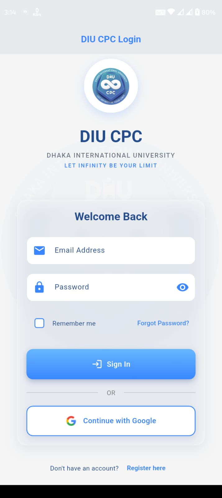 | 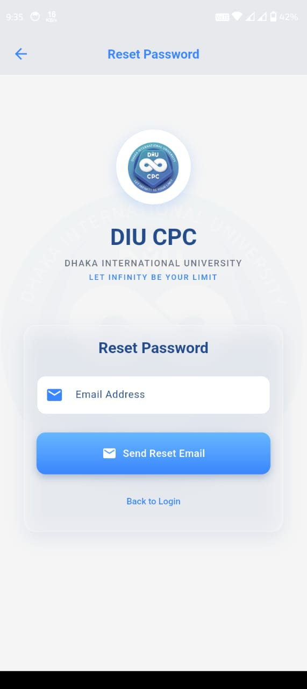 | 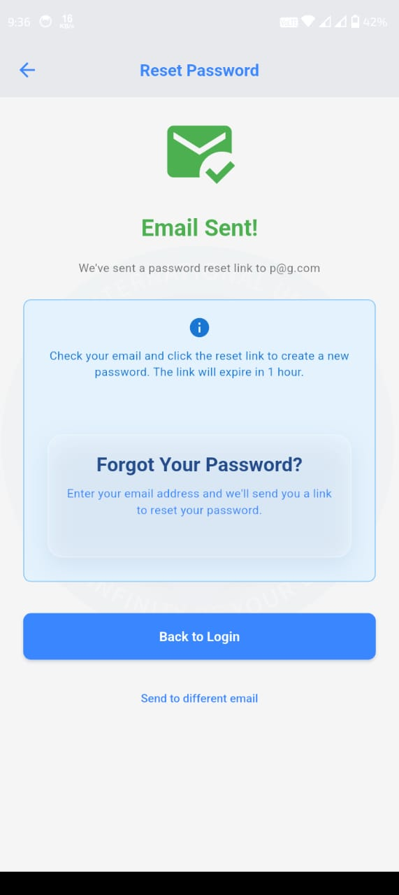 |

| | | |
|:---:|:---:|:---:|
| 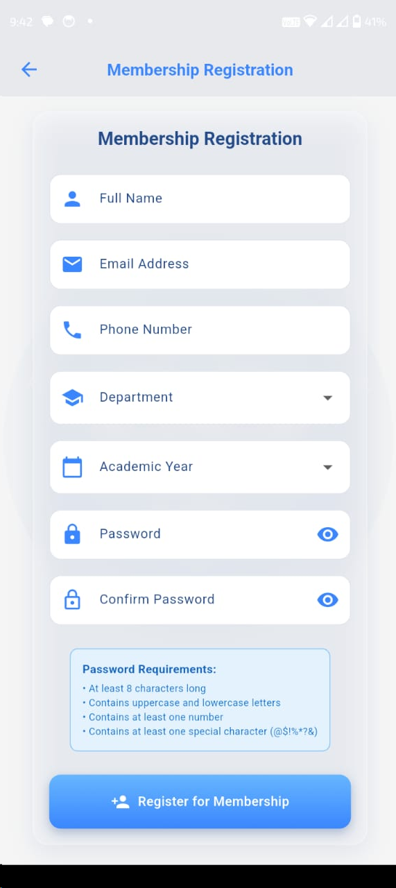 | 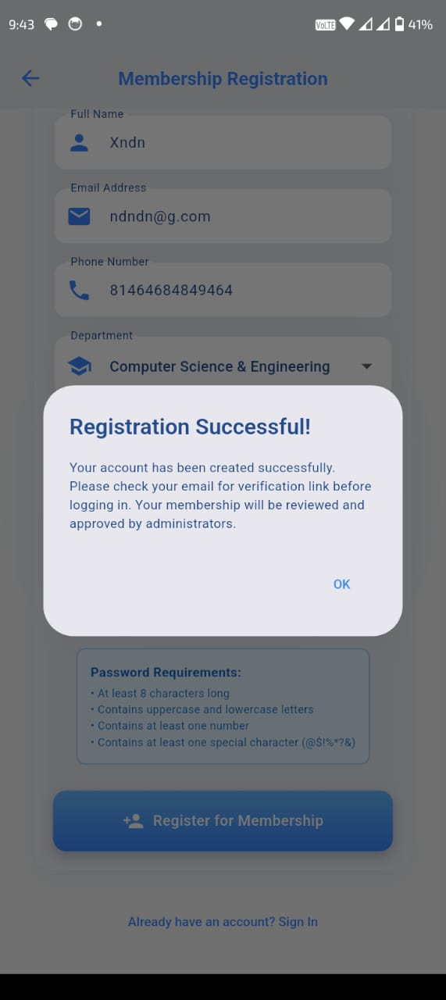 | 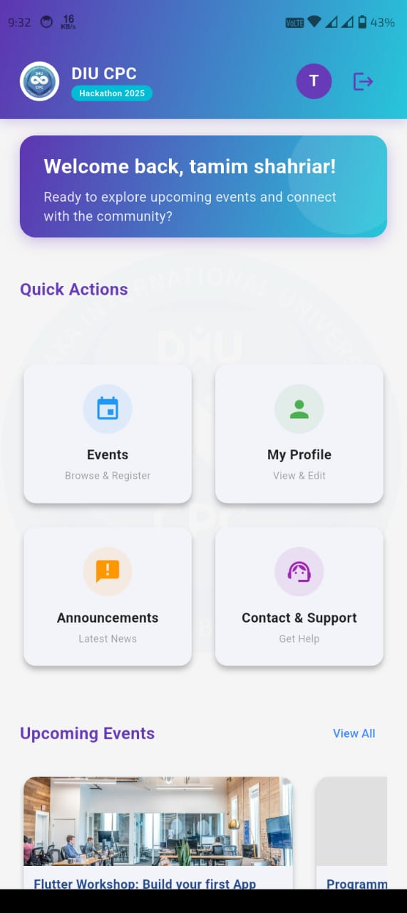 |

| | | |
|:---:|:---:|:---:|
| 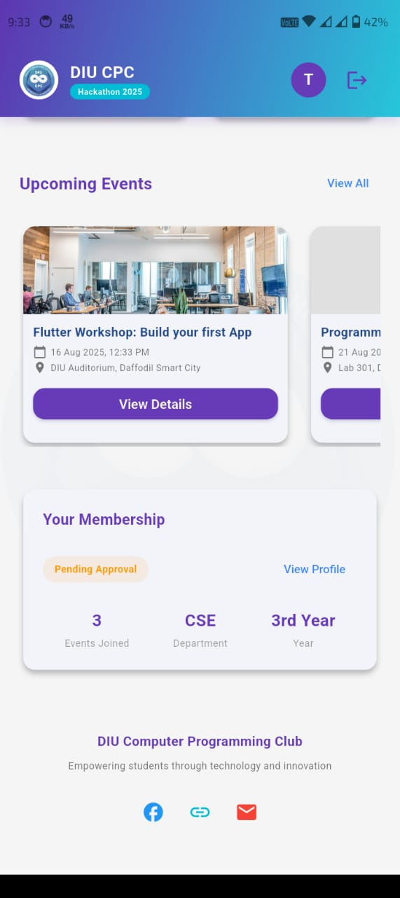 | 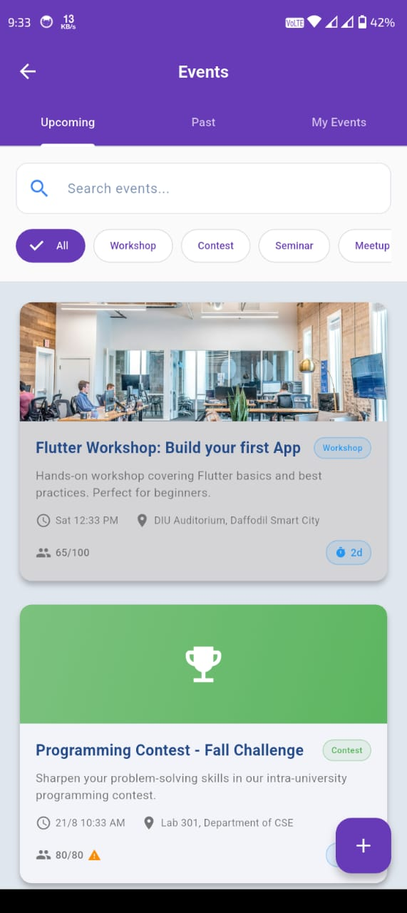 | 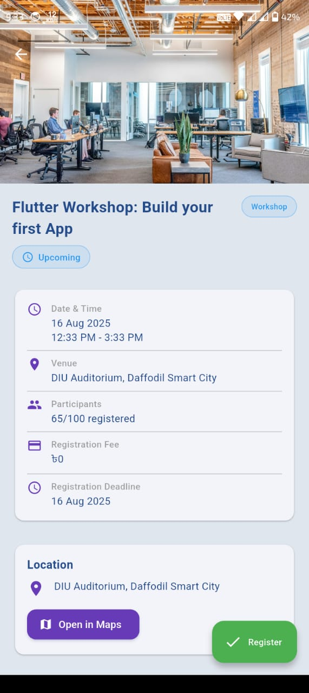 |

| | | |
|:---:|:---:|:---:|
| 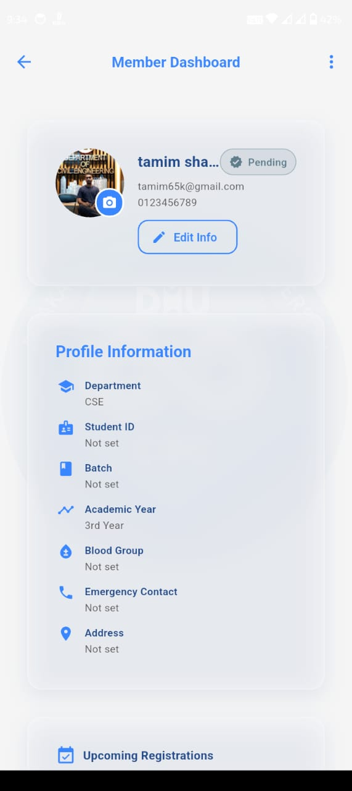 | 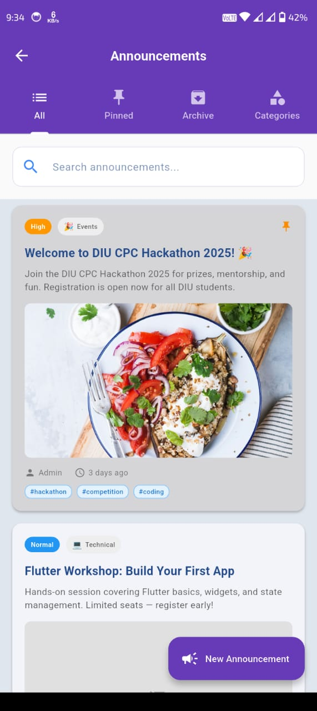 | 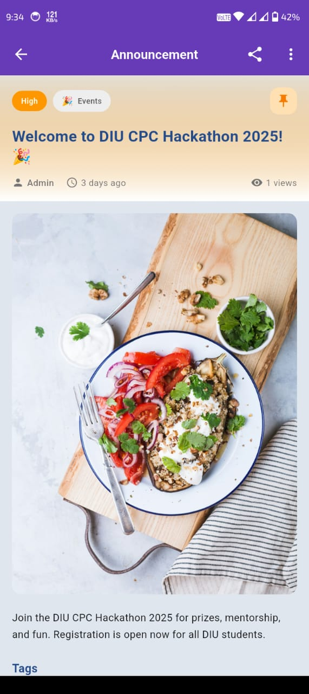 |

| | | |
|:---:|:---:|:---:|
| 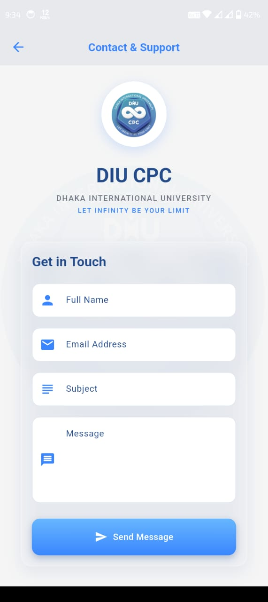 | 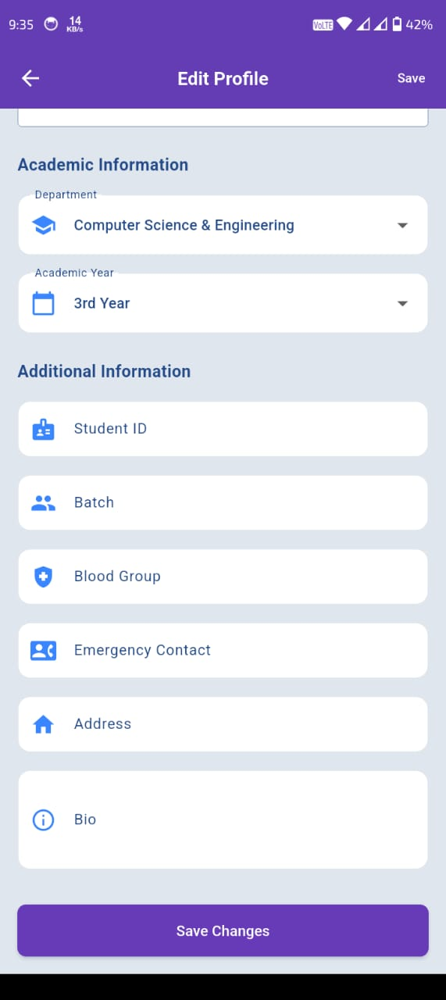 | |

### Admin Panel
| | |
|:---:|:---:|
| 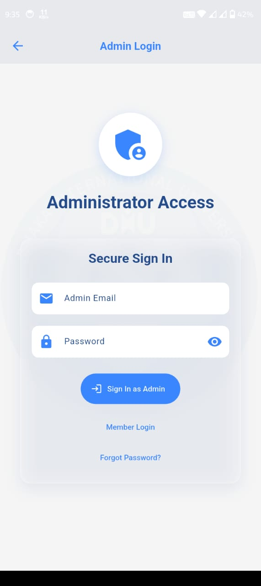 | 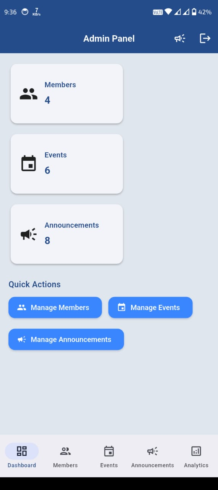 |

## 🏗️ Project Structure

```
lib/
├── main.dart                 # Application entry point
├── auth_wrapper.dart         # Authentication wrapper
├── home_screen.dart          # Main home screen
├── login_screen.dart         # User login screen
├── signup_screen.dart        # User registration screen
├── features/                 # Feature modules
│   ├── admin/               # Admin panel features
│   │   ├── admin_login_screen.dart
│   │   ├── admin_panel_screen.dart
│   │   ├── analytics/
│   │   ├── announcements/
│   │   └── members/
│   ├── announcements/       # Announcements feature
│   ├── authentication/      # Authentication features
│   ├── contact/            # Contact information
│   ├── events/             # Event management
│   ├── profile/            # User profile management
│   └── registration/       # Event registration
├── models/                  # Data models
├── services/               # Business logic services
├── theme/                  # App theming
├── utils/                  # Utility functions
└── widgets/                # Reusable widgets
```

## 🔧 Configuration

### Firebase Configuration
1. Create a Firebase project at [Firebase Console](https://console.firebase.google.com/)
2. Enable Authentication with Email/Password and Google Sign-In
3. Set up Cloud Firestore database
4. Configure Firebase Storage for image uploads
5. Add your platform-specific configuration files

### Dependencies
Key dependencies include:
- `firebase_core`: Firebase SDK core
- `firebase_auth`: Authentication services
- `cloud_firestore`: NoSQL database
- `firebase_storage`: File storage
- `google_sign_in`: Google authentication
- `image_picker`: Image selection
- `url_launcher`: External link handling

## 🎯 Usage

### For Users
1. **Sign Up/Login**: Create an account or login with existing credentials
2. **Explore Events**: Browse upcoming programming events and competitions
3. **Register for Events**: Sign up for events you're interested in
4. **Stay Updated**: Check announcements for club updates
5. **Manage Profile**: Update your profile information and preferences

### For Administrators
1. **Admin Login**: Access the admin panel with admin credentials
2. **Manage Members**: View and manage club member information
3. **Create Events**: Add new programming events and competitions
4. **Post Announcements**: Share important updates with members
5. **View Analytics**: Monitor club engagement and statistics

## 🤝 Contributing

1. Fork the repository
2. Create a feature branch (`git checkout -b feature/AmazingFeature`)
3. Commit your changes (`git commit -m 'Add some AmazingFeature'`)
4. Push to the branch (`git push origin feature/AmazingFeature`)
5. Open a Pull Request

## 📄 License

This project is licensed under the MIT License - see the LICENSE file for details.

## 📞 Support

For support and questions:
- Contact the DIU Computer Programming Club
- Create an issue in this repository
- Reach out through the contact screen in the app

## 🙏 Acknowledgments

- Dhaka International University
- Computer Programming Club members
- Flutter and Firebase communities
- All contributors to this project

---

**Built with ❤️ for the DIU Computer Programming Club**
